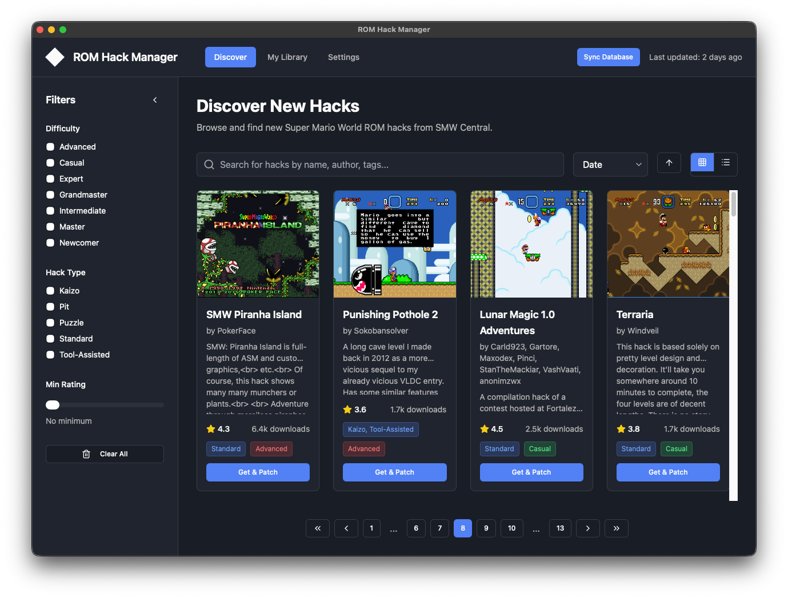
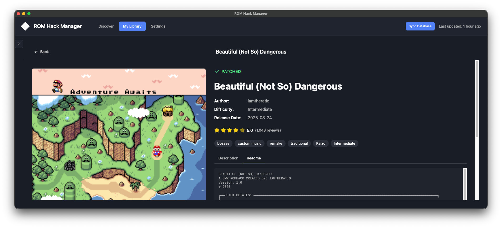

# ROM Hack Manager (rh-mgr)

A modern desktop application for managing Super Mario World ROM hacks. Discover, patch, and launch SMW hacks with ease.

Detailed documentation is available at **[https://SiliconFish42.github.io/rh-mgr/](https://SiliconFish42.github.io/rh-mgr/)**.

## Features

- **📚 Library Management**: Organize and manage your patched ROM hacks in a local library
- **🔍 Discovery**: Browse and discover new hacks from SMW Central
- **🔧 ROM Patching**: Automatically patch clean ROMs with hack files (supports IPS, BPS, and UPS formats)
- **🎮 Emulator Integration**: Launch hacks directly with your configured emulator

## Screenshots





## Quick Start

### Installation

Download the latest release for your platform from the [Releases](https://github.com/SiliconFish42/rh-mgr/releases) page.

For detailed installation instructions, see the [Installation Guide](https://SiliconFish42.github.io/rh-mgr/guide/installation).

### Usage

1. Launch the application.
2. Follow the setup wizard to select your clean Super Mario World ROM.
3. Start browsing and patching hacks!

For a comprehensive guide, check out the [Getting Started](https://SiliconFish42.github.io/rh-mgr/guide/getting-started) page.

## Development

To build the application from source:

```bash
git clone https://github.com/SiliconFish42/rh-mgr.git
cd rh-mgr
npm install
npm run tauri dev
```

See the [Developer Guide](https://SiliconFish42.github.io/rh-mgr/developer/setup) for more information.

## License

This project is licensed under the MIT License - see the [LICENSE](LICENSE) file for details.
